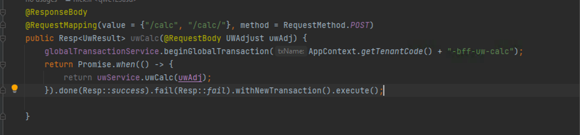
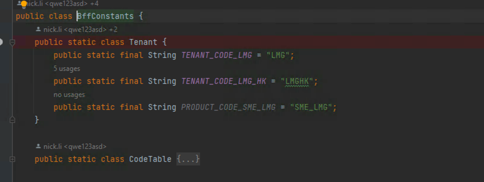
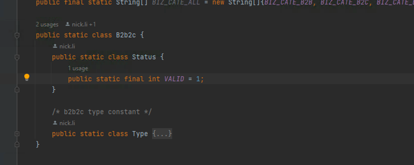
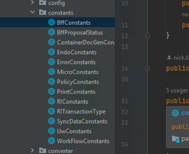
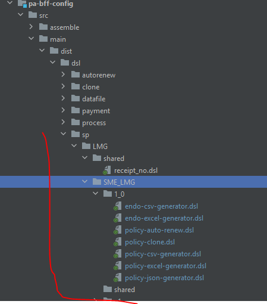
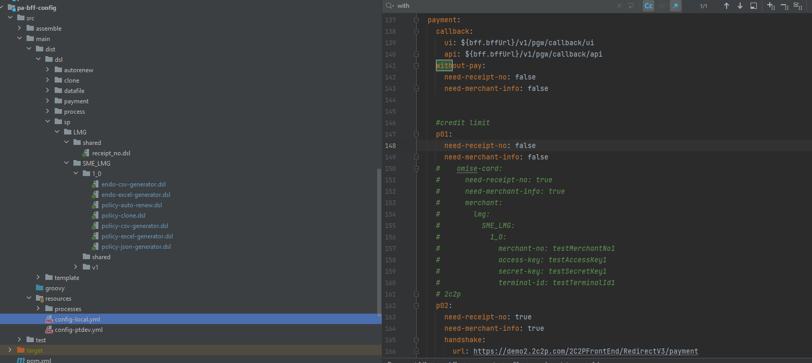

1.  开发语言
    主要用Java 11,    脚本配置用groovy,    upload 配置(pa-bff-tenant)用groovy
 
2. API 层
放在pa-bff-app,  restful package 里
使用统一的API 异常处理，  Response

 
 
3. Domain 层
用来放数据库表对应的Hibernate Entity 类， 每个类应该使用主键实现 hashCode, equals 方法，   Entity 类 里可以放当前类的简单业务操作或判断方法，
4. DAO   层
用来做domain  类里数据库的操作， 放在pa-bff-common,  repo   package里， 如果多个紧密相关的repo,  可以添加 sub package
5. Service
用来放业务逻辑， 但尽量避免引入 API 相关依赖， 比如HttpServeletRequest
Model 层
用来放非数据库相关的模型类
 
6. 常量
BFF 用到的常量只能用BFF 或GIMO 的， 不应该用Common 里的
平台级别常量放在 BffConstants 里， 用不同的类进一步对常量分组
 
 
模块级别放在各模块对应的常量类里
 
 
7. 工具类
工具类使用 优先级，   Bff > GIMO>  Common

8. 依赖
DD/平台模型，依赖的修改需要AA  Review。
 
9. Dsl
Dsl 存放位置
所有DSL 文件按照下面（标红部分） 结构来存放
目录1_0 对应产品版本 1.0
 
 
 10. 配置参数
Bff 里用到的配置参数， 定义在pa-bff-config 下面 resources/config-{env}.yml 配置文件里，
Bff有工具类支持不同级别参数动态查找（从下往上）,  比如图中 access-key,   可以配置在产品级别，租户级别，也可以配置在支付方式级别
 
 
 
11. 产品页面  url  规范  ，   /quote/b2b/{countryCode}/{tenantCode}/{prodCode}

12. UW message 配置
UW message 配置在Translation > UI label 下，
PA-UW-MSG_<UW RULE CODE>   配置 UW alert mssage
PA-UW-REASON_<UW_RULE_CODE>  配置UW reason